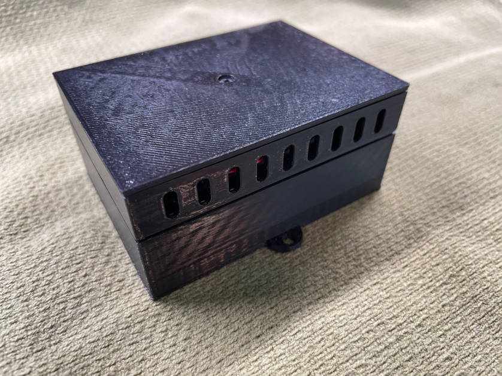

Bluetooth Low Energy Environmental Sensor
-----------------------------------------
This project shows you how to build a Bluetooth Low Energy environmental sensor with the Adafruit nRF52840 Express and 
the Adafruit BME680. The program rests using very little power until a timer powers up the sensor and broadcasts the 
readings. These readings are received and logged into a SQLite database by my 
[Bluetooth Low Energy Sensor Service](https://github.com/patrickmoffitt/ble_sensor_service) project. I've also provided 
a [CGI](https://github.com/patrickmoffitt/ble_sensor_cgi) so you can RESTfully query the data in JSON and inspect it 
with [interactive data graphics](https://github.com/patrickmoffitt/ble_sensor_charts) powered by 
[Plotly](https://plotly.com/javascript/).

Schematic
---------

- [Eechema Schematic PDF](images/zephyr_ble_sensor.pdf)
- [Eechema Schematic](images/zephyr_ble_sensor.sch)

Building
--------
I used the [Zephyr Project](https://www.zephyrproject.org/) to build this project. If you plan to do the same, and you're
not already familiar with it, you'll want to follow the directions in the 
[Getting Started](https://docs.zephyrproject.org/latest/getting_started/index.html) guide. If you don't already own a 
[Segger J-Link](https://www.adafruit.com/product/3571) taking up this project is a great reason to buy one.

Materials List
--------------
- [Adafruit Feather nRF5280 Express](https://www.adafruit.com/product/4062)
- [Lithium Ion Battery Pack - 3.7V 6600mAh](https://www.adafruit.com/product/353)
- [Pololu 5V Step-Up Voltage Regulator U1V11F5](https://www.pololu.com/product/2562)
- [Adafruit BME680 - Temperature, Humidity, Pressure and Gas Sensor - STEMMA QT](https://www.adafruit.com/product/3660)

Notes on Construction
---------------------
I designed a battery box with a circuit compartment and a lid to hold this project. (See the pictures below.) After you 
print the parts you'll need to epoxy in three plastic stand-offs so you can use plastic screws to hold the parts together.
In the circuit compartment I used museum putty to anchor the boards. My hope is that this approach will make it easy to 
re-use the box for my next project since the putty is easy to remove.

- [Battery Box STL](images/6600_ma_hr_battery_box.stl)
- [Circuit Compartment STL](images/6600_ma_hr_circuits_box.stl)
- [Lid STL](6600_ma_hr_box_lid.stl)

Assembly Images
---------------

Bugs, Issues, and Pull Requests
------------------------------
If you find a bug please create an issue. If you'd like to contribute please send a pull request.

